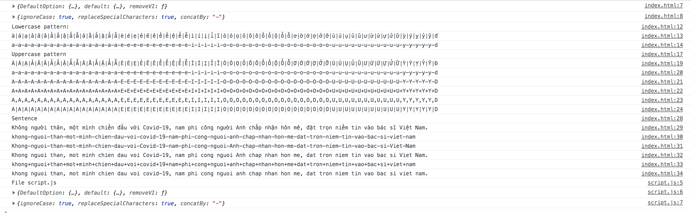

# jsrmvi

[![NPM version][npm-image]][npm-url]
[![NPM downloads][downloads-image]][downloads-url]
[](https://GitHub.com/huynhsamha/jsrmvi/tags)

[](https://lbesson.mit-license.org/)

[npm-image]: https://img.shields.io/npm/v/jsrmvi.svg?style=flat
[npm-url]: https://www.npmjs.com/package/jsrmvi
[downloads-image]: https://img.shields.io/npm/dm/jsrmvi.svg?style=flat
[downloads-url]: https://www.npmjs.com/package/jsrmvi

🇻🇳 Convert Vietnamese words to Latin alphabet 🇻🇳 Use for both Node.JS and Browser.

## Installation

### Node.JS

```bash
npm install --save jsrmvi
# or
yarn add jsrmvi
```

### Browser

Download file `jsrmvi.min.js` at [here](https://github.com/huynhsamha/jsrmvi/blob/master/dist/jsrmvi.min.js) or we can use CDN for NPM such as [unpkg](https://unpkg.com/) or [jsDelivr](https://www.jsdelivr.com/).

```html
<!-- Use CDN -->
<!-- use jsDelivr -->
<script src="https://cdn.jsdelivr.net/jsrmvi/dist/jsrmvi.min.js"></script>
<!-- or use unpkg -->
<script src="https://unpkg.com/jsrmvi/dist/jsrmvi.min.js"></script>

<!-- or download file directly -->
<script src="[path/to/dist]/jsrmvi.min.js"></script>
```

## Usage

### Node.JS

#### Syntax `require`

```js
const jsrmvi = require('jsrmvi');
const { removeVI, DefaultOption } = jsrmvi;
// or
const { removeVI, DefaultOption } = require('jsrmvi');

// Default option used in function removeVI()
console.log(DefaultOption);
/*
{
  ignoreCase: true,
  replaceSpecialCharacters: true,
  concatBy: '-'
}
*/
```

#### Syntax `import`

```js
import jsrmvi from 'jsrmvi';
const { removeVI, DefaultOption } = jsrmvi;
// or
import { removeVI, DefaultOption } from 'jsrmvi';
```

#### Example

##### For a vietnamese sentence

```js
const text01 = 'Không người thân, một mình chiến đấu với Covid-19, nam phi công người Anh chấp nhận hôn mê, đặt trọn niềm tin vào bác sĩ Việt Nam.';
console.log('Sentence');
console.log(text01);
console.log(removeVI(text01));
console.log(removeVI(text01, { ignoreCase: false }));
console.log(removeVI(text01, { ignoreCase: false, replaceSpecialCharacters: false }));
console.log(removeVI(text01, { concatBy: '+' }));
console.log(removeVI(text01, { replaceSpecialCharacters: false }));
/*
Sentence
Không người thân, một mình chiến đấu với Covid-19, nam phi công người Anh chấp nhận hôn mê, đặt trọn niềm tin vào bác sĩ Việt Nam.
khong-nguoi-than-mot-minh-chien-dau-voi-covid-19-nam-phi-cong-nguoi-anh-chap-nhan-hon-me-dat-tron-niem-tin-vao-bac-si-viet-nam
Khong-nguoi-than-mot-minh-chien-dau-voi-Covid-19-nam-phi-cong-nguoi-Anh-chap-nhan-hon-me-dat-tron-niem-tin-vao-bac-si-Viet-Nam
Khong nguoi than, mot minh chien dau voi Covid-19, nam phi cong nguoi Anh chap nhan hon me, dat tron niem tin vao bac si Viet Nam.
khong+nguoi+than+mot+minh+chien+dau+voi+covid+19+nam+phi+cong+nguoi+anh+chap+nhan+hon+me+dat+tron+niem+tin+vao+bac+si+viet+nam
khong nguoi than, mot minh chien dau voi covid-19, nam phi cong nguoi anh chap nhan hon me, dat tron niem tin vao bac si viet nam.
*/
```

##### For an empty or null text

```js
console.log('Null or empty text:');
console.log('1: ' + removeVI());
console.log('2: ' + removeVI(null));
console.log('3: ' + removeVI(undefined));
console.log('4: ' + removeVI(''));
console.log();
/*
Null or empty text:
1:
2:
3:
4:
*/
```

##### For a paragraph

```js
const text02 = fs.readFileSync(path.join(__dirname, '../samples/text.txt'), { encoding: 'utf8' });
console.log('Paragraph');
console.log(text02);
console.log(removeVI(text02, { ignoreCase: false, replaceSpecialCharacters: false }));
console.log();
/*
Paragraph
Trong cơn mưa chiều 22/5, các bác sĩ Bệnh viện Bệnh Nhiệt đới TP.HCM và Bệnh viện Chợ Rẫy khẩn trương vận chuyển bệnh nhân 91 (nam phi công người Anh, 43 tuổi) lên xe cứu thương. Bệnh nhân di chuyển cùng hệ thống máy ECMO, máy lọc máu và dây nhợ chằng chịt.
Trước đó, Bệnh viện Chợ Rẫy đã phong toả toàn bộ lối đi chính, hơn chục bảo vệ và lực lượng công an bố trí dọn đường. Bệnh nhân đi đến đâu, con đường phía sau được xịt khuẩn đến đó.

Trong con mua chieu 22/5, cac bac si Benh vien Benh Nhiet doi TP.HCM va Benh vien Cho Ray khan truong van chuyen benh nhan 91 (nam phi cong nguoi Anh, 43 tuoi) len xe cuu thuong. Benh nhan di chuyen cung he thong may ECMO, may loc mau va day nho chang chit.
Truoc do, Benh vien Cho Ray da phong toa toan bo loi di chinh, hon chuc bao ve va luc luong cong an bo tri don duong. Benh nhan di den dau, con duong phia sau duoc xit khuan den do.

*/
```

#### Options

In `TypeScript`, we define the interface `Options`:

```ts
interface Options {
	ignoreCase: boolean;
	replaceSpecialCharacters: boolean;
	concatBy: string;
}
```

+ `ignoreCase`: convert all uppercase characters to lowercase. Default is `true`.
+ `replaceSpecialCharacters`: replace all special characters to `concatBy` character. Default is `true`.
+ `concatBy`: character we want to replace special characters. Default is `-`.


#### More examples

You can see more examples in directory [`./test/node/src/es5.js`](./test/node/src/es5.js)

### Browser

After file `jsrmvi.min.js` is loaded, object `jsrmvi` will be exported globally to `window` object. We can access `jsrmvi` by `window.jsrmvi` or `jsrmvi` directly.

```html
<script src="https://unpkg.com/jsrmvi/dist/jsrmvi.min.js"></script>

<script>
	const { removeVI, DefaultOption } = jsrmvi;

	console.log(jsrmvi);
	console.log(DefaultOption);

	const text01 = 'Không người thân, một mình chiến đấu với Covid-19, nam phi công người Anh chấp nhận hôn mê, đặt trọn niềm tin vào bác sĩ Việt Nam.';
	console.log('Sentence');
	console.log(text01);
	console.log(removeVI(text01));
	console.log(removeVI(text01, { ignoreCase: false }));
	console.log(removeVI(text01, { ignoreCase: false, replaceSpecialCharacters: false }));
	console.log(removeVI(text01, { concatBy: '+' }));
	console.log(removeVI(text01, { replaceSpecialCharacters: false }));
</script>
```

Examples are similar with NodeJS. You can try with [`test/browser/index.html`](./test/browser/index.html) on browser.

Output on browser for examples in file [`test/browser/index.html`](./test/browser/index.html):



## API

### removeVI

**Method**

```ts
removeVI = (text?: string, options?: Options) => string;
```

+ `text`: sentense we want to convert, can be null.
+ `options`: option we want to convert, can be null.

**Return**: `string`, converted sentence.

```ts
interface Options {
	ignoreCase: boolean;
	replaceSpecialCharacters: boolean;
	concatBy: string;
}
```

+ `ignoreCase`: convert all uppercase characters to lowercase. Default is `true`.
+ `replaceSpecialCharacters`: replace all special characters to `concatBy` character. Default is `true`.
+ `concatBy`: character we want to replace special characters. Default is `-`.

## Dependencies

No dependencies

## Development

### Quickstart

+ Clone the repository and enter the project

```bash
git clone https://github.com/huynhsamha/jsrmvi.git
cd jsrmvi
```

+ Install dependencies

```bash
yarn
```

+ Lint and format source (directory `src`)

```bash
yarn format # defined in package.json
yarn lint   # defined in package.json
```

+ Build package for Node

```bash
yarn dist:node  # defined in package.json
```

Output directory is `dist` (defined in file `tsconfig.json`)

+ Build package for Browser

```bash
yarn dist:browser  # defined in package.json and rollup.config.js
```

+ Build dist (both Node and Browser)

```bash
yarn dist  # defined in package.json
```

### Testing

In directory `test`, we can test the package in environments NodeJS, Browser, pre-published NPM package and the released package.

+ Folder [`./test/node`](./test/node): test for NodeJS in development.
+ Folder [`./test/browser`](./test/browser): test for Browser in development.
+ Folder [`./test/npm`](./test/npm): test for pre-published NPM package. We need to run `npm pack` to make tarball file and move this file to the folder for testing.
+ Folder [`./test/release`](./test/release): test the released package.
